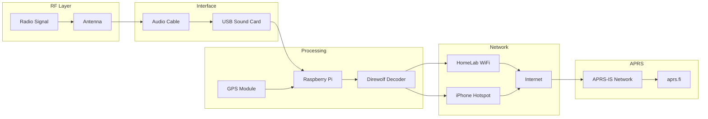

# 📡 Ceds APRS iGate (Dual Node System)

> Raspberry Pi-based APRS iGate system with network failover, GPS integration, and HomeLab infrastructure connectivity


---

## 🚀 Overview

This project builds a **dual-node APRS iGate system** designed for:

- 📡 Reliable APRS packet decoding and forwarding
- 🌐 Continuous internet connectivity (failover enabled)
- 🚗 Mobile + 🏠 Home deployment
- 🧠 Integration into Ced’s HomeLab infrastructure

The system bridges:

**Radio → Raspberry Pi → Direwolf → Internet → APRS-IS → aprs.fi**

---

## 🏗️ Architecture

### 🔹 Home iGate
- Runs on Raspberry Pi (HomeLab VLAN)
- Always-on station
- Stable APRS-IS uplink
- Connected to fixed antenna + audio interface

### 🔹 Mobile iGate
- Raspberry Pi Zero 2 W
- Connects to:
  - 🏠 HomeLab WiFi (primary)
  - 📱 iPhone hotspot (fallback)
- GPS-enabled for live tracking
- Designed for portability and redundancy

---

## 📊 System Diagram



---

## 🔁 System Flow

1. Radio receives APRS packet  
2. Audio is passed into Raspberry Pi via USB sound card  
3. Direwolf decodes packet  
4. Packet is forwarded to APRS-IS via internet  
5. Data appears on aprs.fi  

---

## 🌐 Network Failover Logic

This system automatically prioritizes connections:

1. **Primary:** HomeLab WiFi  
2. **Fallback:** Mobile hotspot  

Configured using:

```bash
nmcli connection modify <wifi> connection.autoconnect-priority 10
nmcli connection modify <hotspot> connection.autoconnect-priority 5
```

This ensures:
- Continuous APRS-IS connectivity
- Automatic recovery during network loss

---

## ⚙️ Features

- Direwolf APRS decoding
- APRS-IS upload
- Network failover (WiFi ↔ hotspot)
- Systemd auto-start on boot
- GPS integration for mobile tracking
- GitHub-documented configs and setup

---

## 🧠 Ced’s HomeLab Integration

This iGate is part of a larger system: **Ced’s HomeLab**

### 🔗 Role in the Lab

- Acts as an **edge data ingestion node**
- Bridges RF (radio) into IP-based systems
- Runs on isolated HomeLab VLAN

### 🌐 Network Placement

- Connected to HomeLab WiFi (primary)
- Uses hotspot fallback for redundancy
- Designed for continuous uptime

### 🧩 Why This Matters

This project demonstrates:

- Real-world **edge computing**
- Hardware + software integration
- Network failover design
- Linux service management

This is not just a radio project — it is a **distributed system inside a home infrastructure environment**

---

## 🧰 Hardware

- Raspberry Pi 3B+ (Home iGate)
- Raspberry Pi Zero 2 W (Mobile iGate)
- QRZ-1 Explorer radios
- USB sound cards
- Audio interface cables
- USB GPS receiver

---

## 🆔 APRS Identities

- `KJ5JCO-7` → handheld radio  
- `KJ5JCO-10` → home iGate  
- `KJ5JCO-15` → mobile iGate  

---

## 📁 Repository Layout

```text
ceds-aprs-igate/
├── README.md
├── diagrams/
├── docs/
├── configs/
├── scripts/
├── parts/
├── screenshots/
└── notes/
```

---

## ⚠️ Security Notes

- APRS passcode is NOT stored in this repo
- Credentials are handled locally only
- Prevents accidental exposure

---

## 🧭 Roadmap

- [ ] Finish home audio wiring
- [ ] Finish mobile audio wiring
- [ ] Add GPS module to mobile build
- [ ] Capture aprs.fi screenshots
- [ ] Add wiring diagrams
- [ ] Field testing and validation

---

## 🚀 Quick Start

Install dependencies:

```bash
sudo apt update
sudo apt upgrade -y
sudo apt install direwolf gpsd gpsd-clients netcat-openbsd -y
```

Test connectivity:

```bash
ping -c 3 google.com
getent hosts noam.aprs2.net
nc -vz noam.aprs2.net 14580
```

Enable service:

```bash
sudo cp ./configs/home/direwolf.service /etc/systemd/system/direwolf.service
sudo systemctl daemon-reload
sudo systemctl enable direwolf
sudo systemctl start direwolf
```