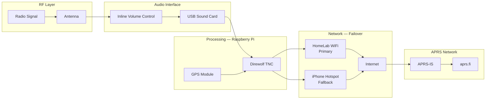

# Ced's APRS iGate — Dual-Node RF Edge System

> A dual-node APRS iGate system bridging amateur radio RF signals to the internet — running on Raspberry Pi hardware with automatic network failover, GPS tracking, and integration into Ced's HomeLab infrastructure.

[](#aprs-identities)
[](#hardware)
[](#software-stack)
[](https://aprs.fi/#!call=KJ5JCO)
[](https://noc.chasedumphord.com)

---

## Why I Built This

Most people think of a homelab as servers, VMs, and containers. This project is what happens when you take that same systems-thinking mindset and apply it to RF and radio infrastructure.

As a licensed amateur radio operator (KJ5JCO), I wanted to build something that bridged the physical and digital worlds — an edge data ingestion system that takes real radio signals off the air, decodes them, and injects them into an IP-based network. That's not just a radio project. That's distributed systems thinking applied to RF.

The home iGate runs 24/7 on the HomeLab VLAN. The mobile iGate runs on a Pi Zero 2W with automatic failover between HomeLab WiFi and an iPhone hotspot. Both nodes uplink decoded APRS packets to the global APRS-IS network, where they appear live on aprs.fi.

The most technically interesting part wasn't the software — it was tuning the audio chain. Getting reliable packet decodes required hitting a specific audio level window (50–60) and adding an inline volume controller between the radio and the USB sound card. Too high and you get clipping. Too low and you miss packets. That kind of hardware-software integration is what makes this project more than a tutorial follow-along.

---

## System Architecture



---

## Dual-Node Setup

### Home iGate — KJ5JCO-10

Always-on station running on the HomeLab VLAN. Fixed antenna, stable APRS-IS uplink, systemd-managed for automatic restart on boot.

| Component | Detail |
|-----------|--------|
| Hardware | Raspberry Pi 3B+ |
| Radio | QRZ-1 Explorer |
| Interface | USB sound card + inline volume control |
| Network | HomeLab WiFi (primary) / hotspot (fallback) |
| SSID | KJ5JCO-10 |
| Status | Live — verified on aprs.fi |

### Mobile iGate — KJ5JCO-15

Portable build designed for field deployment. GPS-enabled for live position tracking. ETH-USB-HUB-BOX provides power, USB expansion, and wired networking in a compact form factor.

| Component | Detail |
|-----------|--------|
| Hardware | Raspberry Pi Zero 2W |
| Expansion | ETH-USB-HUB-BOX |
| Interface | USB sound card + audio cables |
| Network | HomeLab WiFi (primary) / iPhone hotspot (fallback) |
| GPS | USB GPS receiver |
| SSID | KJ5JCO-15 |
| Status | In progress — mobile audio wiring pending |

---

## APRS Identities

| Callsign | Role |
|----------|------|
| KJ5JCO-7 | Handheld radio |
| KJ5JCO-10 | Home iGate |
| KJ5JCO-15 | Mobile iGate |

---

## Audio Chain — The Critical Detail

Getting reliable packet decodes required precise audio chain tuning. This was the hardest part of the build.

```
Radio → Inline Volume Controller → USB Sound Card → Raspberry Pi → Direwolf
```

**Target audio level: 50–60**

- Too high → clipping and decode errors
- Too low → missed packets
- Tuned using live beacon testing with real FT5D transmissions and Direwolf output monitoring

The inline volume controller between the radio and USB sound card is not optional — it's what makes reliable decoding possible.

---

## Network Failover

The system automatically prioritizes connections using `nmcli` connection priorities:

```bash
nmcli connection modify <homelab-wifi> connection.autoconnect-priority 10
nmcli connection modify <iphone-hotspot> connection.autoconnect-priority 5
```

When HomeLab WiFi drops, the system fails over to the iPhone hotspot automatically — maintaining continuous APRS-IS uplink without manual intervention.

---

## Software Stack

| Software | Role |
|----------|------|
| Direwolf | APRS TNC — packet decoding and APRS-IS uplink |
| APRS-IS | Global APRS internet backbone |
| gpsd | GPS daemon for mobile position tracking |
| nmcli | Network priority and failover management |
| systemd | Service management — auto-start on boot |

---

## Direwolf Configuration

> APRS passcode is replaced with `<PASSCODE>` — never stored in this repo.

```conf
ADEVICE plughw:1,0
ACHANNELS 1
ARATE 44100

CHANNEL 0
MYCALL KJ5JCO-10

MODEM 1200

AGWPORT 8000
KISSPORT 8001

IGSERVER noam.aprs2.net
IGLOGIN KJ5JCO-10 <PASSCODE>

PBEACON sendto=IG delay=1 every=30 lat=34.3310 long=-89.5227 symbol=igate comment="Ced's Home iGate"
```

---

## Quick Start

**Install dependencies:**

```bash
sudo apt update && sudo apt upgrade -y
sudo apt install direwolf gpsd gpsd-clients netcat-openbsd -y
```

**Test APRS-IS connectivity:**

```bash
ping -c 3 google.com
getent hosts noam.aprs2.net
nc -vz noam.aprs2.net 14580
```

**Enable Direwolf as a service:**

```bash
sudo cp ./configs/home/direwolf.service /etc/systemd/system/direwolf.service
sudo systemctl daemon-reload
sudo systemctl enable direwolf
sudo systemctl start direwolf
```

---

## Repository Structure

```
ceds-aprs-igate/
├── configs/            # Direwolf configs for home and mobile nodes
├── diagrams/           # System architecture diagrams
├── docs/               # Setup documentation and notes
├── notes/              # Field notes and tuning logs
├── parts/              # Hardware parts list
├── scripts/            # Setup and helper scripts
└── screenshots/        # aprs.fi verification screenshots
```

---

## Troubleshooting

### Audio level too high

```
Audio input level is too high
```

Add an inline volume controller between the radio and USB sound card. Tune Direwolf audio level to 50–60 using live beacon testing.

### Audio device busy

```
Could not open audio device plughw:1,0 — Device or resource busy
```

```bash
sudo systemctl stop direwolf
sudo killall direwolf
fuser -v /dev/snd/*
```

### APRS-IS not updating

Verify `MYCALL` and `IGLOGIN` use the same SSID — mismatch causes silent auth failures:

```conf
MYCALL KJ5JCO-10
IGLOGIN KJ5JCO-10 <PASSCODE>
```

### Missing beacons

Normal APRS behavior. Packet collisions, RF conditions, and local traffic levels all affect decode rate. Consistent decodes over time matter more than catching every single packet.

---

## Roadmap

- [x] Home iGate audio chain tuned and verified
- [x] Home iGate live on aprs.fi (KJ5JCO-10)
- [x] GPS module added to mobile build
- [x] Network failover configured (WiFi → hotspot)
- [x] systemd service management on both nodes
- [ ] Mobile audio wiring complete
- [ ] Mobile iGate live on aprs.fi (KJ5JCO-15)
- [ ] aprs.fi verification screenshots added
- [ ] Wiring diagrams added to diagrams/
- [ ] NOC dashboard integration (Grafana panel for APRS data)

---

## HomeLab Integration

This iGate is part of **Ced's HomeLab** — a broader infrastructure stack built around real systems engineering.

The APRS nodes act as RF edge ingestion points: physical radio signals decoded, digitized, and injected into an IP network. It's the same pattern used in industrial IoT — sensors at the edge feeding data into a central system — except the sensor is a radio and the edge device is a Raspberry Pi.

| Project | Description |
|---------|-------------|
| [ceds-homelab](https://github.com/ced4568/ceds-homelab) | 6-node Proxmox cluster, TrueNAS, full infrastructure |
| [ced-k3s-homelab](https://github.com/ced4568/ced-k3s-homelab) | 12-node K3s cluster on Raspberry Pi |
| [ced-portfolio](https://github.com/ced4568/ced-portfolio) | Source for chasedumphord.com |

---

## Author

**Chase Dumphord (Ced) — KJ5JCO**
Digital Systems Engineer · GE Aerospace · Oxford, MS

[](https://chasedumphord.com)
[](https://www.linkedin.com/in/chase-dumphord/)
[](https://github.com/ced4568)
[](https://aprs.fi/#!call=KJ5JCO)
[](https://noc.chasedumphord.com)