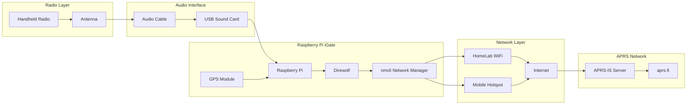

# 📡 APRS iGate Architecture

```mermaid
flowchart LR

    subgraph Radio Layer
        HT[Handheld Radio]
        ANT[Antenna]
    end

    subgraph Audio Interface
        CABLE[Audio Cable]
        USB[USB Sound Card]
    end

    subgraph Raspberry Pi iGate
        PI[Raspberry Pi]
        DW[Direwolf]
        GPS[GPS Module]
        NM[nmcli Network Manager]
    end

    subgraph Network Layer
        WIFI[HomeLab WiFi]
        HOTSPOT[Mobile Hotspot]
        INTERNET[Internet]
    end

    subgraph APRS Network
        APRSIS[APRS-IS Server]
        APRSFI[aprs.fi]
    end

    HT --> ANT --> CABLE --> USB --> PI
    PI --> DW
    GPS --> PI

    DW --> NM

    NM --> WIFI
    NM --> HOTSPOT

    WIFI --> INTERNET
    HOTSPOT --> INTERNET

    INTERNET --> APRSIS
    APRSIS --> APRSFI
```